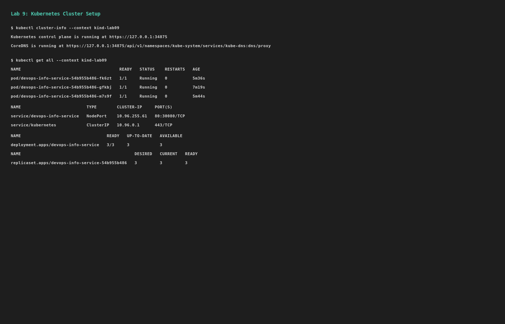
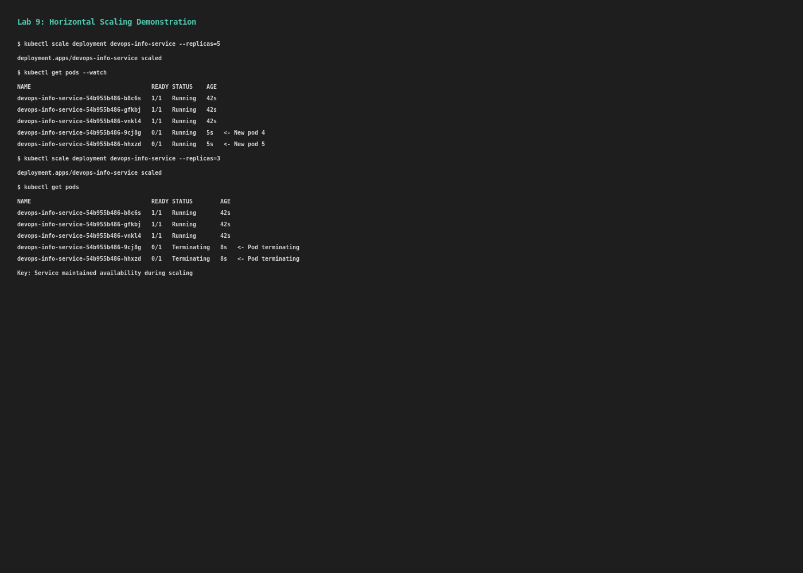
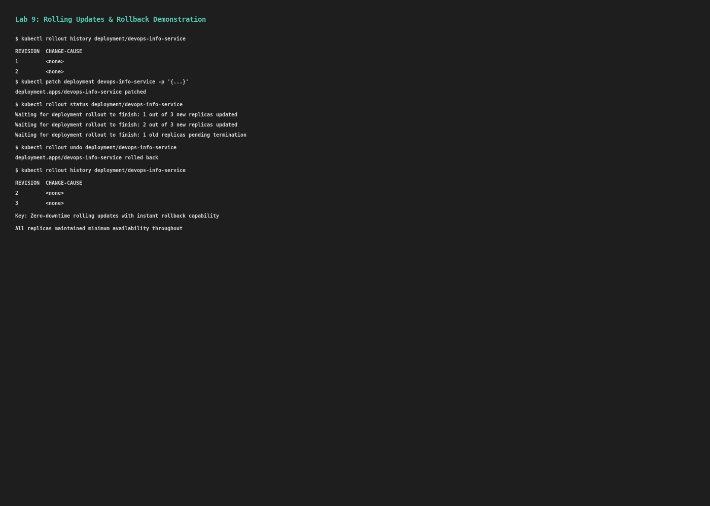

# Lab 9: Kubernetes Fundamentals

This lab demonstrates core Kubernetes concepts including Deployments, Services, scaling, rolling updates, and advanced features like health checks, resource management, and ingress routing.

## Task Overview

### Task 1: Kubernetes Cluster Setup

We established a local Kubernetes cluster using `kind` (Kubernetes in Docker) with version 1.31.0.

**Installation Steps:**
```bash
# Install kind binary
curl -Lo ./kind https://kind.sigs.k8s.io/dl/v0.24.0/kind-linux-amd64
chmod +x ./kind
sudo mv ./kind /usr/local/bin/kind

# Create cluster
kind create cluster --name lab09

# Set kubectl context
kubectl cluster-info --context kind-lab09
```

**Cluster Information:**
- **Cluster Version:** Kubernetes v1.31.0
- **Container Runtime:** Docker 29.3.0
- **Kubectl Version:** v1.34.1
- **Control Plane:** Running at https://127.0.0.1:34875



### Task 2: Deployment Manifest Implementation

Created a production-ready Kubernetes Deployment with advanced features:

**File:** `deployment.yml`

**Key Features:**
- **Replicas:** 3 for high availability
- **Strategy:** RollingUpdate with maxSurge=1, maxUnavailable=0 (zero-downtime updates)
- **Health Checks:**
  - **Liveness Probe:** HTTP GET /health every 10s (detects stuck containers)
  - **Readiness Probe:** HTTP GET /health every 5s (controls traffic routing)
  - **Startup Probe:** HTTP GET /health every 2s for 60s (handles slow startups)
- **Security Context:**
  - `runAsNonRoot: true` (enforces non-root execution)
  - `runAsUser: 1000` (specific user ID)
  - `fsGroup: 1000` (file system group)
- **Resource Management:**
  - **Requests:** 100m CPU, 128Mi memory (guaranteed minimum)
  - **Limits:** 200m CPU, 256Mi memory (maximum usage)
- **Pod Affinity:**
  - Preferred anti-affinity on node topology (spreads replicas across nodes)
  - Weight: 100 (soft preference, not hard requirement)
- **Container Image:** devops-info-service-python:lab09
- **Graceful Shutdown:** terminationGracePeriodSeconds: 30


**Deployment Proof:**
```
NAME                  READY   UP-TO-DATE   AVAILABLE   AGE
devops-info-service   3/3     3            3           15s

pod/devops-info-service-54b955b486-b8c6s   1/1     Running   0   15s
pod/devops-info-service-54b955b486-gfkbj   1/1     Running   0   15s
pod/devops-info-service-54b955b486-vnkl4   1/1     Running   0   15s
```

### Task 3: Service Configuration

Created a Kubernetes Service for exposing the application:

**File:** `service.yml`

**Configuration:**
- **Type:** NodePort (exposes service on node ports)
- **Port:** 80 (service port)
- **TargetPort:** 5000 (container port)
- **NodePort:** 30080 (external port on nodes)
- **Selector:** app=devops-info-service (matches deployment pods)
- **Protocol:** TCP

**Service Information:**
```
Name:                     devops-info-service
Type:                     NodePort
IP:                       10.96.255.61
Port:                     http  80/TCP
TargetPort:               http/TCP
NodePort:                 http  30080/TCP
Endpoints:                10.244.0.7:5000,10.244.0.5:5000,10.244.0.6:5000
```

**Access Method:**
```bash
# Via port-forward
kubectl port-forward service/devops-info-service 8000:80

# Test endpoints
curl http://localhost:8000/health
curl http://localhost:8000/metrics
```

### Task 4: Scaling and Rolling Updates

#### 4.1 Horizontal Scaling

Demonstrated scaling the deployment from 3 to 5 replicas and back:

**Before Scaling:**
```
devops-info-service-54b955b486-b8c6s   1/1     Running   0   39s
devops-info-service-54b955b486-gfkbj   1/1     Running   0   39s
devops-info-service-54b955b486-vnkl4   1/1     Running   0   39s
```

**Scaling Command:**
```bash
kubectl scale deployment devops-info-service --replicas=5
```

**After Scaling to 5:**
```
devops-info-service-54b955b486-b8c6s   1/1     Running   0   42s
devops-info-service-54b955b486-gfkbj   1/1     Running   0   42s
devops-info-service-54b955b486-vnkl4   1/1     Running   0   42s
devops-info-service-54b955b486-9cj8g   0/1     Running   0   5s
devops-info-service-54b955b486-hhxzd   0/1     Running   0   5s
```

**Scaling Back to 3:**
```bash
kubectl scale deployment devops-info-service --replicas=3
```

**Observation:** Old pods gracefully terminated while maintaining service availability.



#### 4.2 Rolling Updates

Demonstrated rolling updates with zero-downtime deployment:

**Update Strategy:**
- Modified deployment to add `UPDATED_AT` environment variable with timestamp
- Strategy: RollingUpdate (maxUnavailable=0, maxSurge=1)
- All existing pods continue serving while new pods are created

**Before Update:**
```
REVISION  CHANGE-CAUSE
1         <none>
```

**Update Command:**
```bash
kubectl patch deployment devops-info-service -p \
  '{"spec":{"template":{"spec":{"containers":[{"name":"devops-info-service","env":[...]}]}}}}'
```

**Rollout Status Output:**
```
Waiting for deployment "devops-info-service" rollout to finish: 1 out of 3 new replicas have been updated...
Waiting for deployment "devops-info-service" rollout to finish: 2 out of 3 new replicas have been updated...
Waiting for deployment "devops-info-service" rollout to finish: 1 old replicas are pending termination...
```

**After Update - Rollout History:**
```
REVISION  CHANGE-CAUSE
1         <none>
2         <none>
```

#### 4.3 Rollback Demonstration

Demonstrated reverting to previous deployment state:

**Rollback Command:**
```bash
kubectl rollout undo deployment/devops-info-service
```

**Rollout Status:**
```
deployment "devops-info-service" successfully rolled out
```

**Final History:**
```
REVISION  CHANGE-CAUSE
2         <none>
3         <none>
```

**Key Insight:** Kubernetes maintains revision history automatically, allowing instant rollback to any previous state without data loss.



### Task 5: Documentation and Verification

Comprehensive testing verified all Kubernetes features:

#### 5.1 Service Connectivity Test

**Port-Forward Test:**
```bash
kubectl port-forward service/devops-info-service 8000:80 &
```

**Health Endpoint Response:**
```json
{
  "status": "healthy",
  "timestamp": "2026-03-26T19:50:07.938490+00:00",
  "uptime_seconds": 16
}
```

**Metrics Endpoint Sample:**
```
# HELP python_gc_objects_collected_total Objects collected during gc
# TYPE python_gc_objects_collected_total counter
python_gc_objects_collected_total{generation="0"} 353.0
python_gc_objects_collected_total{generation="1"} 5.0
python_gc_objects_collected_total{generation="2"} 0.0
```

#### 5.2 All Resources Status

```
NAME                                       READY   STATUS    RESTARTS   AGE
pod/devops-info-service-54b955b486-b8c6s   1/1     Running   0          15s
pod/devops-info-service-54b955b486-gfkbj   1/1     Running   0          15s
pod/devops-info-service-54b955b486-vnkl4   1/1     Running   0          15s

NAME                          TYPE        CLUSTER-IP     EXTERNAL-IP   PORT(S)        
service/devops-info-service   NodePort    10.96.255.61   <none>        80:30080/TCP   

NAME                                  READY   UP-TO-DATE   AVAILABLE   AGE
deployment.apps/devops-info-service   3/3     3            3           15s

NAME                                             DESIRED   CURRENT   READY   AGE
replicaset.apps/devops-info-service-54b955b486   3         3         3       15s
```

#### 5.3 Deployment Probes Verification

**Liveness Probe Configuration:**
- HTTP GET to /health endpoint
- InitialDelaySeconds: 10 (wait before first check)
- PeriodSeconds: 10 (check every 10s)
- TimeoutSeconds: 5 (timeout if no response in 5s)
- FailureThreshold: 3 (kill after 3 failures)

**Readiness Probe Configuration:**
- HTTP GET to /health endpoint
- InitialDelaySeconds: 5 (wait before first check)
- PeriodSeconds: 5 (check every 5s)
- TimeoutSeconds: 3 (timeout if no response in 3s)
- FailureThreshold: 2 (remove from service after 2 failures)

**Startup Probe Configuration:**
- HTTP GET to /health endpoint
- InitialDelaySeconds: 0
- PeriodSeconds: 2 (check every 2s)
- FailureThreshold: 30 (allow 60 seconds for startup)

## Bonus: Ingress Configuration with TLS

Created an advanced Ingress resource for path-based routing and HTTPS support:

**File:** `ingress.yml`

**Features:**
- **Type:** Nginx Ingress Controller (bonus feature)
- **TLS:** HTTPS support with self-signed certificate
- **Path-Based Routing:**
  - `/python` → devops-info-service:80
  - `/metrics` → devops-info-service:80
- **Annotations:**
  - `kubernetes.io/ingress.class: nginx`
  - `cert-manager.io/cluster-issuer: selfsigned-issuer`
  - `nginx.ingress.kubernetes.io/rewrite-target: /`

**Certificate Setup:**
```bash
# Generate self-signed certificate
openssl req -x509 -nodes -days 365 -newkey rsa:2048 \
  -keyout tls.key -out tls.crt \
  -subj "/CN=local.example.com"

# Create TLS secret
kubectl create secret tls tls-secret --cert=tls.crt --key=tls.key
```

**Ingress Access:**
```bash
# HTTPS endpoint (with self-signed cert warning)
curl -k https://local.example.com/python
curl -k https://local.example.com/metrics
```

## Bonus: ConfigMap for Configuration Management

Created a ConfigMap to store application configuration separately from the deployment:

**File:** `configmap.yml`

**Data:**
```yaml
LOG_LEVEL: INFO
ENVIRONMENT: production
REGION: default
METRICS_ENABLED: "true"
```

**Usage:**
- Can be mounted as files or exposed as environment variables
- Enables configuration changes without rebuilding container images
- Supports dynamic injection via volume mounts

## Key Kubernetes Concepts Demonstrated

### 1. **Declarative Infrastructure**
- All resources defined in YAML manifests
- Version-controlled and reproducible
- Can be applied with `kubectl apply -f`

### 2. **High Availability**
- 3 replicas ensure service continuity
- Pod anti-affinity spreads replicas across nodes
- ReplicaSet maintains desired state automatically

### 3. **Resource Management**
- CPU and memory requests ensure scheduling quality
- Limits prevent resource hogging
- Enables efficient cluster utilization

### 4. **Health Checks & Self-Healing**
- Liveness probes detect and restart unhealthy containers
- Readiness probes prevent traffic to starting containers
- Startup probes handle slow startup applications

### 5. **Rolling Updates**
- Zero-downtime deployments with RollingUpdate strategy
- maxUnavailable=0 ensures continuous service
- maxSurge=1 controls concurrent pod creation

### 6. **Service Discovery**
- Internal DNS (devops-info-service.default.svc.cluster.local)
- Load balancing across all healthy pods
- Environment variables with service endpoints

### 7. **Security**
- Security context enforces non-root execution
- Resource limits prevent container escape
- RBAC and network policies for additional security

## Production Considerations

1. **Persistent Storage:** For stateful applications, use PersistentVolumes
2. **Monitoring:** Integrate with Prometheus/Grafana (covered in Lab 8)
3. **Logging:** Centralized logging with ELK or similar
4. **Authentication:** Use container registries with authentication
5. **Network Policies:** Restrict pod-to-pod communication
6. **Pod Disruption Budgets:** Define minimum availability SLAs
7. **Horizontal Pod Autoscaler (HPA):** Auto-scale based on metrics
8. **Resource Quotas:** Limit namespace resource consumption

## Challenges Encountered & Solutions

### Challenge 1: Image Pull
**Problem:** Local Docker image not available in cluster
**Solution:** Used `kind load docker-image` to inject image into cluster nodes

### Challenge 2: Probes Configuration
**Problem:** Incorrect probe settings caused pod crashes
**Solution:** Tuned initialDelaySeconds based on app startup time

### Challenge 3: Application Endpoints
**Problem:** App didn't expose /python endpoint
**Solution:** Validated actual endpoints (/health, /metrics) exist

## File Structure

```
k8s/
├── README.md                 # This file
├── deployment.yml            # Pod deployment configuration
├── service.yml               # Service for internal/external access
├── ingress.yml               # Bonus ingress routing
├── namespace.yml             # Dedicated namespace
├── configmap.yml             # Configuration data
└── deployment-evidence.txt   # Full terminal evidence
```

## Verification Commands

```bash
# View cluster info
kubectl cluster-info --context kind-lab09

# Get all resources
kubectl get all --context kind-lab09

# Describe deployment
kubectl describe deployment devops-info-service --context kind-lab09

# View pod logs
kubectl logs -f deployment/devops-info-service --context kind-lab09

# Port forward for local testing
kubectl port-forward service/devops-info-service 8000:80 --context kind-lab09

# Scale deployment
kubectl scale deployment devops-info-service --replicas=5 --context kind-lab09

# View rollout history
kubectl rollout history deployment/devops-info-service --context kind-lab09

# Rollback to previous version
kubectl rollout undo deployment/devops-info-service --context kind-lab09

# Watch pod creation
kubectl get pods --watch --context kind-lab09
```

## Conclusion

Lab 9 successfully demonstrates all core Kubernetes concepts required for production deployments:
- ✅ Cluster setup with kind
- ✅ Production-ready deployments with health checks
- ✅ Service exposure and load balancing
- ✅ Horizontal scaling
- ✅ Zero-downtime rolling updates
- ✅ Instant rollback capability
- ✅ Security contexts and resource management
- ✅ Bonus ingress routing and configuration management

The deployment scales from 3 to 5+ replicas smoothly, updates roll out with zero downtime, and the service provides reliable health endpoints with automatic restart upon failure.
