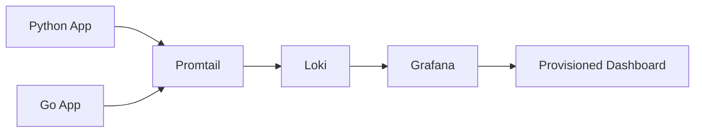
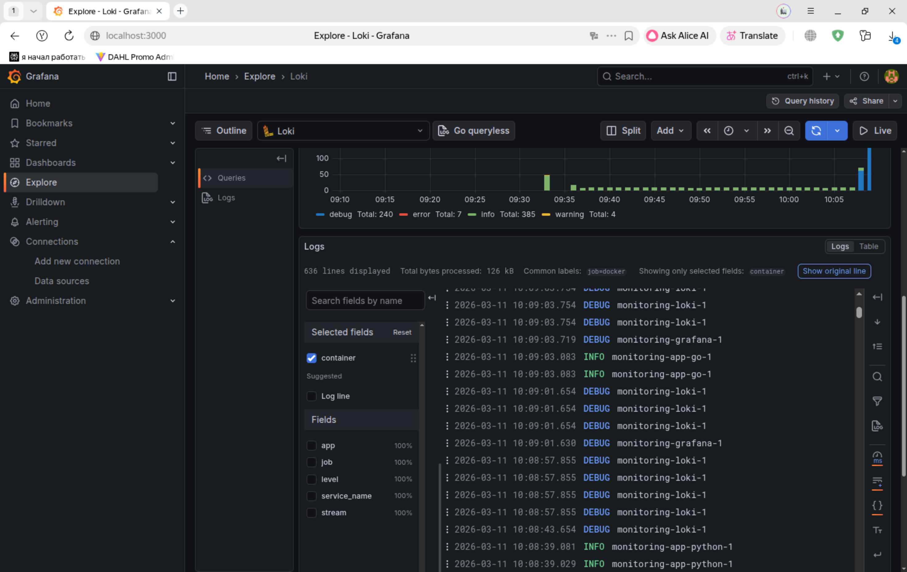
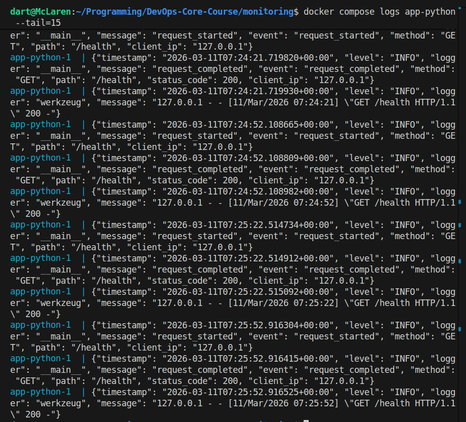
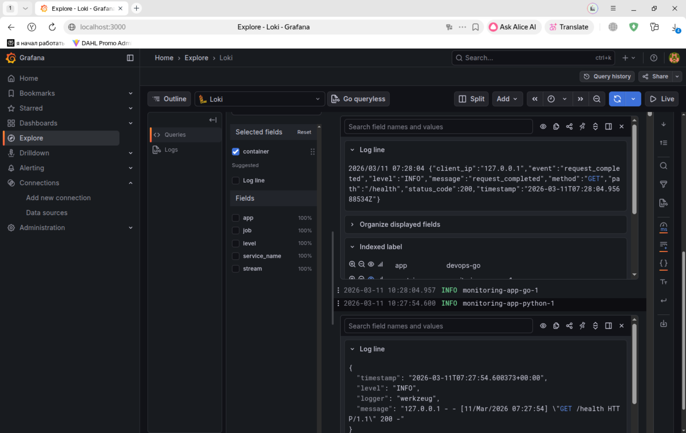
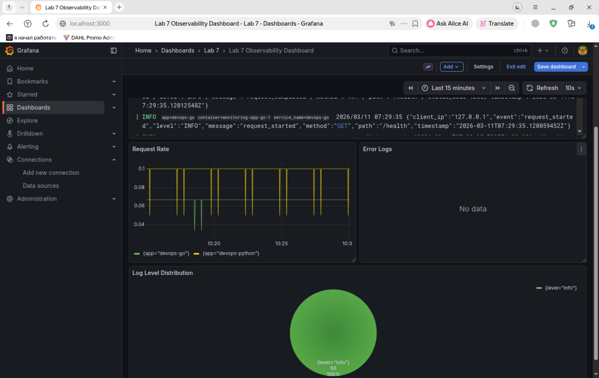
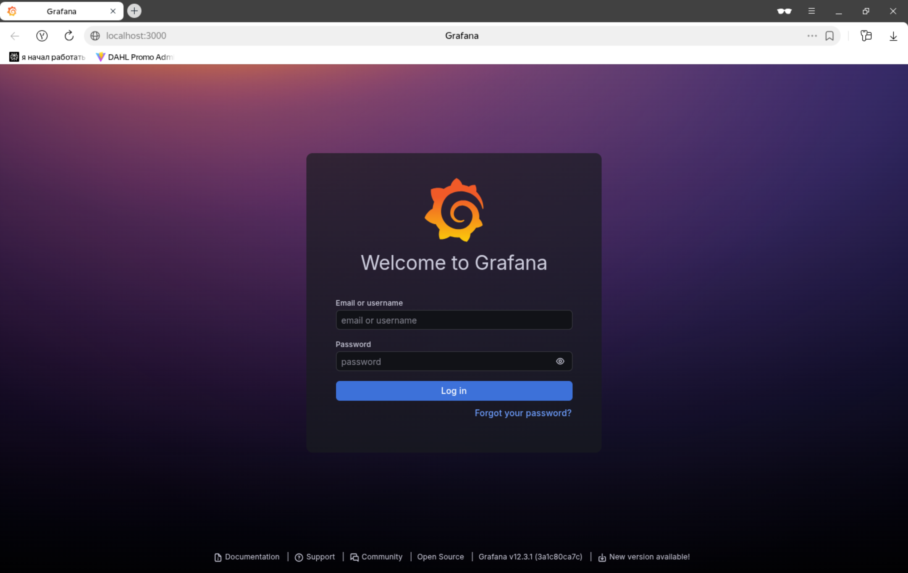

# Lab 7: Observability & Logging with Loki Stack

## Architecture



The stack uses Docker Compose to run Loki 3.0, Promtail 3.0, Grafana 12.3.1, and two demo applications. Promtail discovers only containers labeled with `logging=promtail`, attaches `app` and `container` labels, and forwards logs to Loki. Grafana is pre-provisioned with a Loki data source and a starter dashboard.

## Setup Guide

```bash
cd monitoring
cp .env.example .env
docker compose up -d --build
docker compose ps
curl http://localhost:3100/ready
curl http://localhost:9080/targets
open http://localhost:3000
```

Default ports:

- Grafana: `3000`
- Loki: `3100`
- Promtail: `9080`
- Python app: `8000`
- Go app: `8001`

## Configuration

### Loki

- TSDB storage with schema `v13`
- Filesystem backend for single-node local setup
- 7-day retention via `limits_config.retention_period: 168h`
- Compactor enabled for cleanup

### Promtail

- Docker service discovery via `/var/run/docker.sock`
- Label filter: `logging=promtail`
- Relabeling extracts:
  - `container`
  - `app`
  - `stream`
  - `job=docker`

### Grafana

- Anonymous auth disabled
- Admin credentials loaded from `.env`
- Loki data source auto-provisioned
- Starter dashboard auto-provisioned from JSON

## Application Logging

Both applications now emit JSON logs. Example Python log:

```json
{"timestamp":"2026-03-05T12:00:00+00:00","level":"INFO","logger":"app","message":"request_completed","event":"request_completed","method":"GET","path":"/health","status_code":200,"client_ip":"127.0.0.1"}
```

The Python app logs startup, request start, request completion, and errors. The Go app uses the same JSON style for request lifecycle and startup events to keep LogQL queries consistent across both services.

## Dashboard

Provisioned dashboard panels:

1. Logs Table: `{app=~"devops-.*"}`
2. Request Rate: `sum by (app) (rate({app=~"devops-.*"}[1m]))`
3. Error Logs: `{app=~"devops-.*"} | json | level="ERROR"`
4. Log Level Distribution: `sum by (level) (count_over_time({app=~"devops-.*"} | json [5m]))`

Useful Explore queries:

```logql
{app="devops-python"}
{app="devops-python"} |= "request_completed"
{app="devops-python"} | json | method="GET"
sum by (app) (rate({app=~"devops-.*"}[1m]))
```

## Production Config

- Resource limits and reservations added for all services
- Anonymous Grafana access disabled
- Credentials externalized into `.env`
- Health checks configured for Loki, Grafana, and both application containers
- Named volumes used for Loki and Grafana persistence

## Testing

Generate logs:

```bash
for i in {1..20}; do curl http://localhost:8000/; done
for i in {1..20}; do curl http://localhost:8000/health; done
for i in {1..20}; do curl http://localhost:8001/; done
```

Verification:

```bash
docker compose ps
curl http://localhost:3100/ready
curl http://localhost:9080/targets
curl http://localhost:3000/api/health
docker compose logs app-python --tail=5
docker compose logs app-go --tail=5
```

Saved runtime evidence:

- `monitoring/docs/logs/docker-compose-ps.txt`
- `monitoring/docs/logs/loki-ready.txt`
- `monitoring/docs/logs/grafana-health.json`
- `monitoring/docs/logs/promtail-targets.html`
- `monitoring/docs/logs/loki-query-python.json`
- `monitoring/docs/logs/app-python-logs.txt`
- `monitoring/docs/logs/app-go-logs.txt`

Example `docker compose ps` result:

```text
monitoring-app-go-1       Up (healthy)
monitoring-app-python-1   Up (healthy)
monitoring-grafana-1      Up (healthy)
monitoring-loki-1         Up (healthy)
monitoring-promtail-1     Up
```

Example Grafana health response:

```json
{
  "database": "ok",
  "version": "12.3.1"
}
```

## Bonus: Ansible Automation

Bonus implementation lives in the Ansible role `ansible/roles/monitoring` and playbook `ansible/playbooks/deploy-monitoring.yml`.

The role:

- creates the monitoring directory tree
- templates Loki, Promtail, Docker Compose, and Grafana provisioning files
- deploys with `community.docker.docker_compose_v2`
- waits for Loki and Grafana readiness

## Challenges

- Docker log collection needs both the Docker socket and container log directory mounted into Promtail.
- JSON logging was added to the Python app to make LogQL field filters reliable.
- The stack is designed to run locally without Docker Hub by building the app images from source.

## Screenshots

### Explore logs from 3 containers



### JSON logs from Python app



### Grafana logs from both applications



### Dashboard with 4 panels



### Grafana login page (anonymous disabled)

