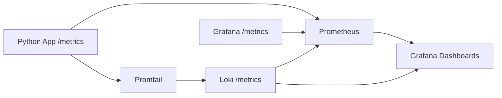
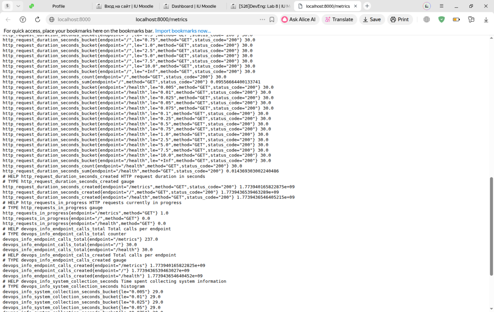
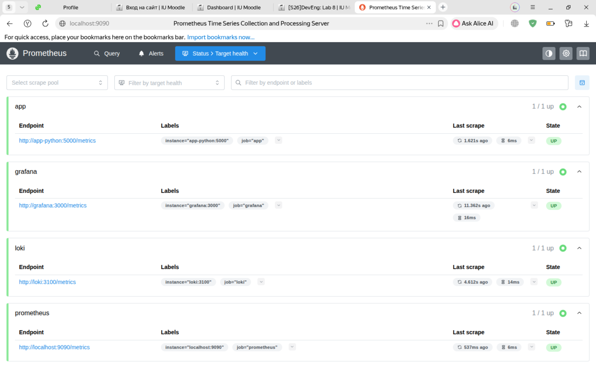
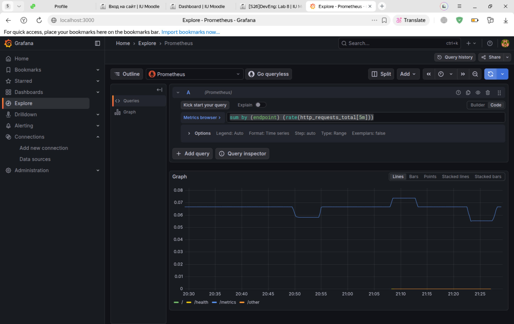
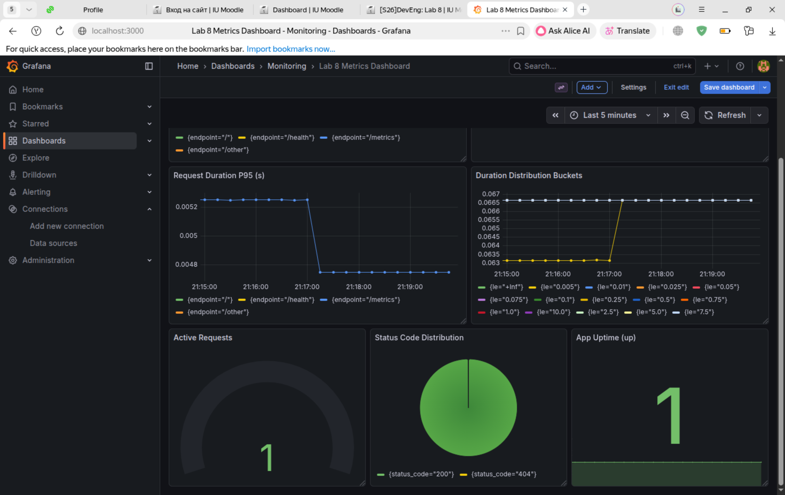

# Lab 8: Metrics & Monitoring with Prometheus

## Architecture



Metrics flow: application and platform services expose `/metrics`, Prometheus scrapes them every 15 seconds, and Grafana visualizes them. Logs flow from Promtail to Loki (Lab 7) and remain available for metrics-vs-logs comparison.

## Application Instrumentation

File: `app_python/app.py`

Implemented metrics:

- `http_requests_total` (Counter): total HTTP requests by `method`, `endpoint`, `status_code`
- `http_request_duration_seconds` (Histogram): request latency by `method`, `endpoint`, `status_code`
- `http_requests_in_progress` (Gauge): active concurrent requests by `method`, `endpoint`
- `devops_info_endpoint_calls_total` (Counter): endpoint-specific business metric
- `devops_info_system_collection_seconds` (Histogram): system info collection duration

Implementation details:

- `/metrics` endpoint added with `prometheus_client.generate_latest`
- `@app.before_request` records request start and enters in-progress gauge context
- `@app.after_request` increments counters and observes duration
- endpoint labels normalized to low-cardinality set: `/`, `/health`, `/metrics`, `/other`

Dependency added:

- `app_python/requirements.txt`: `prometheus-client==0.23.1`

## Prometheus Configuration

Files:

- `monitoring/prometheus/prometheus.yml`
- `monitoring/docker-compose.yml`

Configured scrape jobs:

- `prometheus` -> `localhost:9090`
- `app` -> `app-python:5000` (`/metrics`)
- `loki` -> `loki:3100` (`/metrics`)
- `grafana` -> `grafana:3000` (`/metrics`)

Global settings:

- `scrape_interval: 15s`
- `evaluation_interval: 15s`

Retention settings via container args:

- `--storage.tsdb.retention.time=15d`
- `--storage.tsdb.retention.size=10GB`

## Dashboard Walkthrough

Provisioned dashboard file:

- `monitoring/grafana/dashboards/lab08-metrics.json`

Panel list (7 panels):

1. Request Rate By Endpoint
   Query: `sum by (endpoint) (rate(http_requests_total[5m]))`
2. Error Rate (5xx)
   Query: `sum(rate(http_requests_total{status_code=~"5.."}[5m]))`
3. Request Duration P95 (s)
   Query: `histogram_quantile(0.95, sum by (le, endpoint) (rate(http_request_duration_seconds_bucket[5m])))`
4. Duration Distribution Buckets
   Query: `sum by (le) (rate(http_request_duration_seconds_bucket[5m]))`
5. Active Requests
   Query: `sum(http_requests_in_progress)`
6. Status Code Distribution
   Query: `sum by (status_code) (rate(http_requests_total[5m]))`
7. App Uptime (up)
   Query: `up{job="app"}`

Grafana data source provisioning updated:

- `monitoring/grafana/provisioning/datasources/loki.yml` now includes both Loki and Prometheus.

## PromQL Examples

1. Total request rate:
   `sum(rate(http_requests_total[5m]))`
2. Request rate by endpoint:
   `sum by (endpoint) (rate(http_requests_total[5m]))`
3. 5xx error rate:
   `sum(rate(http_requests_total{status_code=~"5.."}[5m]))`
4. p95 latency:
   `histogram_quantile(0.95, sum by (le) (rate(http_request_duration_seconds_bucket[5m])))`
5. Active requests now:
   `sum(http_requests_in_progress)`
6. Target health:
   `up`

## Production Setup

`monitoring/docker-compose.yml` hardened with:

- health checks for Loki, Grafana, Prometheus, Python app, Go app
- resource limits:
  - Prometheus: `1 CPU`, `1G`
  - Loki: `1 CPU`, `1G`
  - Grafana: `0.5 CPU`, `512M`
  - Apps: `0.5 CPU`, `256M`
- persistent volumes:
  - `prometheus-data`
  - `loki-data`
  - `grafana-data`
- Grafana metrics endpoint enabled (`GF_METRICS_ENABLED=true`)

## Testing Results

### Local run

```bash
cd monitoring
cp -n .env.example .env
docker compose up -d --build
```

### Generate traffic

```bash
for i in {1..30}; do curl -s http://localhost:8000/ > /dev/null; done
for i in {1..30}; do curl -s http://localhost:8000/health > /dev/null; done
```

### Verify metrics and targets

```bash
curl http://localhost:8000/metrics | head -40
curl http://localhost:9090/-/healthy
curl http://localhost:9090/api/v1/targets
curl -G 'http://localhost:9090/api/v1/query' --data-urlencode 'query=up'
docker compose ps
```

Expected:

- Prometheus targets page shows all jobs `UP`
- `http_requests_total`, `http_request_duration_seconds`, `http_requests_in_progress` present in `/metrics`
- Grafana dashboard `Lab 8 Metrics Dashboard` available in folder `Monitoring`

### Evidence checklist to capture

- screenshot: `/metrics` output
- screenshot: Prometheus `/targets` with all UP
- screenshot: PromQL `up` query result
- screenshot: Grafana dashboard with all 7 panels
- command output: `docker compose ps` with healthy containers

## Screenshots

### 1) `/metrics` endpoint output



### 2) Prometheus `/targets` all UP



### 3) PromQL query result (`up`)



### 4) Grafana metrics dashboard (6+ panels)



## Challenges & Solutions

- Metrics label cardinality risk:
  - fixed by endpoint normalization (`/other` for unknown routes)
- Prometheus target naming in Docker network:
  - fixed by scraping container service port `app-python:5000`
- Combining logs and metrics in one Grafana:
  - fixed by provisioning both Loki and Prometheus datasources

## Metrics vs Logs (Lab 7 Comparison)

- Use metrics for trends, SLOs, RED dashboards, and alert thresholds.
- Use logs for deep event context, payload troubleshooting, and root-cause details.
- Combined workflow:
  - detect spike in error rate from Prometheus panel
  - pivot to Loki Explore query by endpoint/status for root cause

## Bonus: Ansible Automation

Extended files in `ansible/roles/monitoring`:

- `defaults/main.yml`: Prometheus variables and scrape targets
- `templates/prometheus.yml.j2`: dynamic scrape config
- `templates/docker-compose.yml.j2`: Prometheus service, retention, health checks, limits
- `templates/grafana-datasource.yml.j2`: Loki + Prometheus datasources
- `templates/grafana-metrics-dashboard.json.j2`: Lab 8 metrics dashboard
- `tasks/setup.yml`: templates Prometheus config and dashboard files
- `tasks/deploy.yml`: waits for and verifies Prometheus health

Playbook:

- `ansible/playbooks/deploy-monitoring.yml`

Run:

```bash
cd ansible
ansible-playbook -i inventory/hosts.ini playbooks/deploy-monitoring.yml
```

Idempotency check:

```bash
ansible-playbook -i inventory/hosts.ini playbooks/deploy-monitoring.yml
```

Second run should report mostly `ok` and minimal `changed`.
